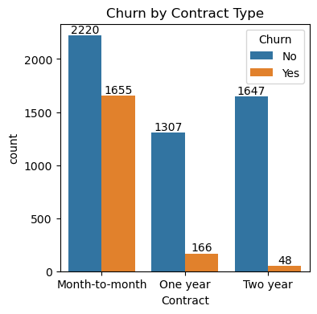

# Customer Churn Analysis

This project explores customer churn patterns in the telecom industry using exploratory data analysis (EDA). The goal is to uncover key insights into which customers are more likely to leave and what factors influence churn, helping inform strategies to improve retention.

---

## Objectives

- Explore **customer churn patterns** using visualizations  
- Identify **key features** related to churn (e.g., contracts, services, payment methods)  
- Gain insights to help **reduce churn** and improve **customer retention**

---

## Tools Used

- Python (Pandas, Seaborn, Matplotlib)
- Jupyter Notebook

---

## Dataset

- Source: [Telco Customer Churn - Kaggle](https://www.kaggle.com/datasets/blastchar/telco-customer-churn)

---

## Key Findings

- Customers with **month-to-month contracts** and those paying via **electronic checks** have significantly **higher churn**.
- Customers using **bundled services** such as OnlineSecurity or TechSupport are **less likely to churn**.
- Promoting **long-term contracts** and **value-added services** may help reduce churn.

---

## Notebook

Check out the full analysis in [`Customer Churn Analysis.ipynb`](https://github.com/PrachiShandilya/customer-churn-analysis/blob/main/Customer%20Churn%20EDA.ipynb)

---
